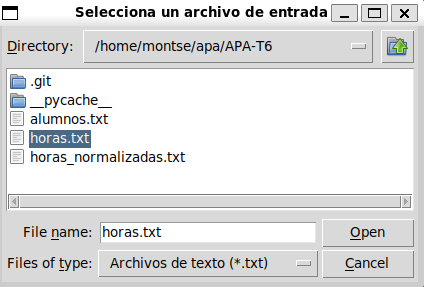
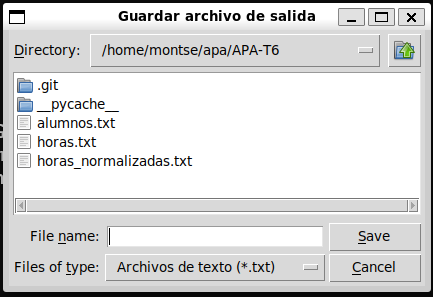
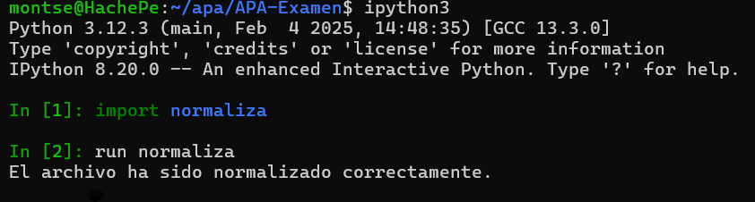
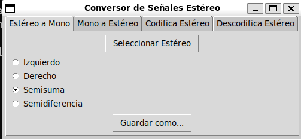
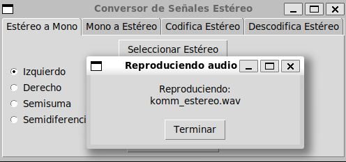
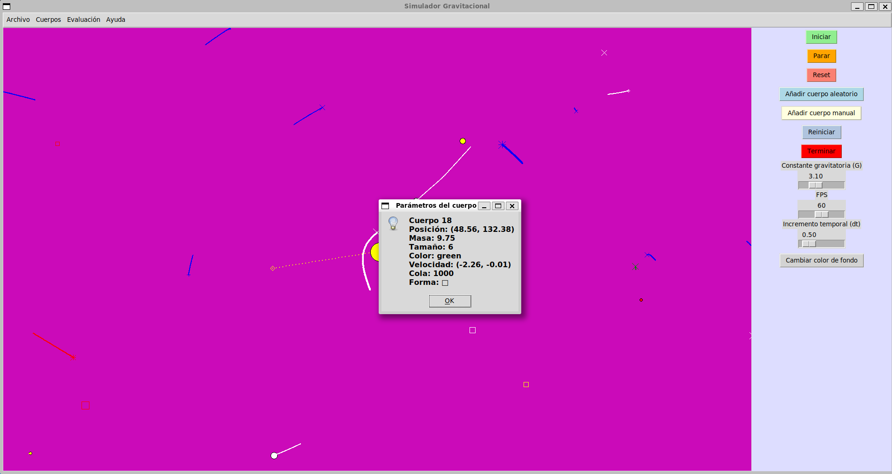
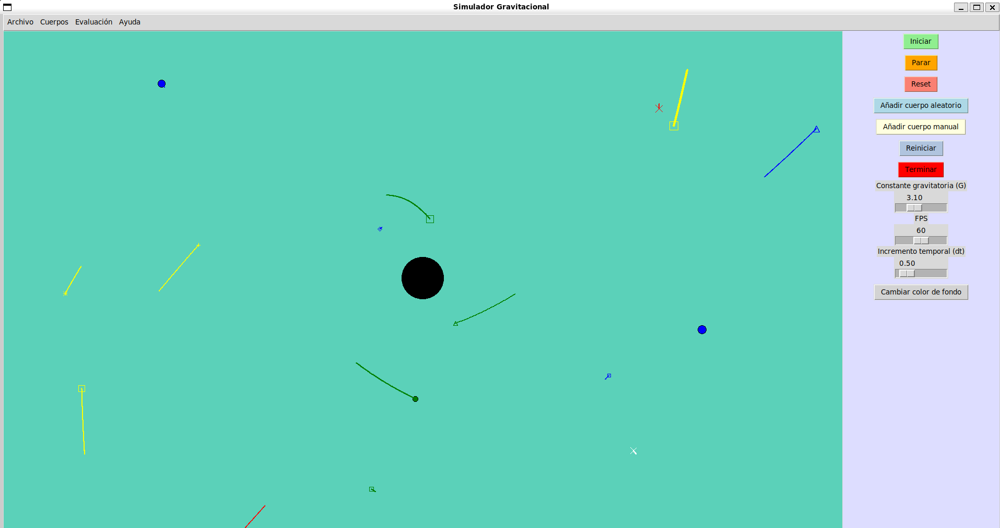

Algorismia i Programació Audiovisual
====================================

Examen Final - Primavera de 2025
--------------------------------

Importante
-----------------------------------------

Rellene la tabla siguiente con los nombres completos y la nota aspirada de cada participante. Recuerde que
si este examen se realiza en solitario, la nota aspirada es 10; si se realiza entre dos, la suma de las
notas aspiradas tiene que ser igual a 16; y si se realiza entre tres, las suma tiene que ser 18.

| Nombre completo              | Nota Aspirada |
| ---------------------------- | ------------- |
| Montserrat Cuevas López      | 10            |
|                              |               |
|                              |               |

También Importante
-------------------------------------------------

Se recuerda que los ejercicios más parecidos de lo razonable se repartirán la nota. Es decir, si dos ejercicios
merecedores de 10 se parecen mucho, la nota de cada uno será $10/2 = 5$; si
el parecido es entre tres ejercicios, la nota será $10/3=3,33$.

Ejercicio 1: Programa de Normalización de Expresiones Horarias (20%)
----------------------------------------------------------------------

- Construya el programa `normaliza.py`que permita leer un fichero de texto, normalice
  las expresiones horarias en él contenidas según las instrucciones de la tarea APA-T6
  y escriba el resultado en otro fichero de texto.
- El fichero de entrada y el nombre del fichero de salida tendrán la extensión `.txt` y
  se escogerán usando las funciones gráficas de `TkInter.filedialog`.
- No se evaluará la calidad de la normalización (ese aspecto se evalúa en APA-T6).

#### Ventanas para escoger y guardar el fichero:

#### Salida en la terminal:

Ejercicio 2: Programa de Manejo de Señales Estéreo (35%)
--------------------------------------------------------

- Construya el programa `mono.py` que permita realizar las funciones de la tarea
  APA-T5 en un entorno gráfico usando TkInter.
- El programa contará con cuatro pestañas de `ttk.notebook`:

  - Pestaña `Estéreo a Mono`
  - Pestaña `Mono a Estéreo`
  - Pestaña `Codifica Estéreo`
  - Pestaña `Descodifica Estéreo`

  En cada una de estas pestañas se dispondrán de todos los artilugios necesarios para:
  
  - Seleccionar el o los ficheros de entrada.
  - Realizar la operación correspondiente.
  - Escuchar cada una de las señales involucradas, tanto de entrada como de salida.
  - Escribir la señal resultante en un fichero cuyo nombre se indicará al seleccionar la opción de `Guardar`.

- No se evaluará la corrección de las funciones desarrolladas en la tarea APA-T5, pero el programa deberá
  ser compatible con sus interfaces, de manera que, al susituir el
  `estereo.py` presentado por uno que funcione correctamente, el programa `mono.py` también lo hará.

  #### Visualización de las ventanas:

   

Ejercicio 3: Programa de Visualización de Cuerpos Sometidos a Atracción Gravitatoria (45%)
---------------------------------------------------------------------------------------------

Realizar un programa de simulación de cuerpos celestes sometidos a la Ley de Gravitación Universal
de Newton. Como mínimo debe tener las mismas funcionalidades del programa `gravedad.exe` subido a Atenea
y hacerlo igual o mejor que éste.

#### Código:

Disponible en `gravedad.py`.

#### ¿Qué hace el código? 

Aparte de las funcionalidades del programa "gravedad.exe". Este puede:

- Cargar y guardar una constelación de cuerpos desde un archivo JSON.

- Editar los parámetros de un cuerpo.

- Añadir cuerpos aleatorios mediante un botón en el que vas clicando y se añade un nuevo cuerpo aleatorio. Se ha considerado que es más eficiente esta opción que la de añadir directamente x cuerpos aleatorios. 

- Empezar la simulación con el botón iniciar, en el otro caso empezaba directamente tan solo añadiendo cuerpos. Como programa nos deja añadir cuerpos mientras se inicia la simulación, se ha pensado que es una buena opción poder iniciar después de haber creado los cuerpos que uno quiere.

- Al parar la simulación puedes clicar encima de un cuerpo y ver sus datos.

- Si la masa del cuerpo es igual o más grande de 70 se crea un agujero negro. Al iniciar la simulación se cambia el color de este al negro y cada que un cuerpo se acerca a él este lo absorbe, haciendo que dicho cuerpo desaparezca y el agujero negro aumente en masa.

Entrega
-------

Los tres programas deberán estar preparados para ser ejecutados desde la línea de comandos o desde
una sesión `ipython` usando el comando `%run`.
